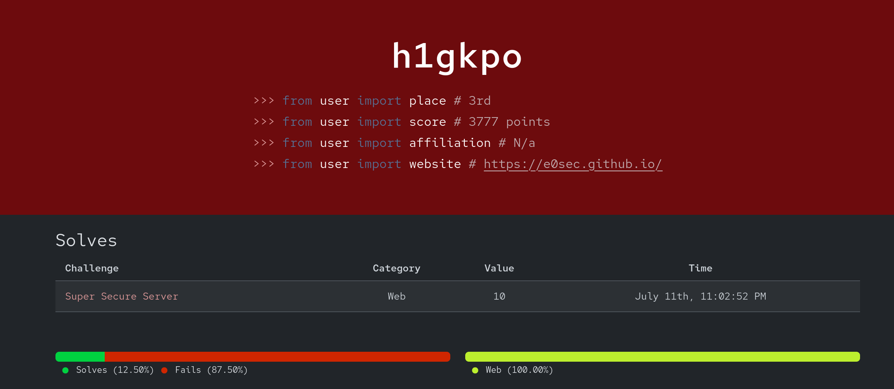
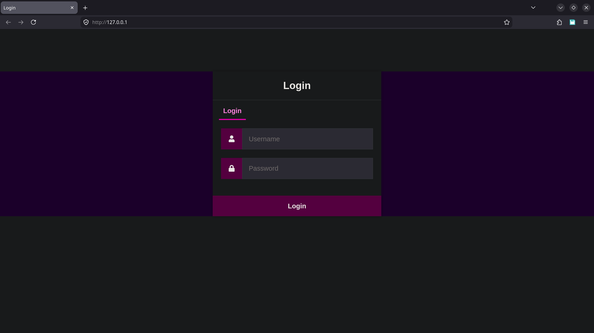
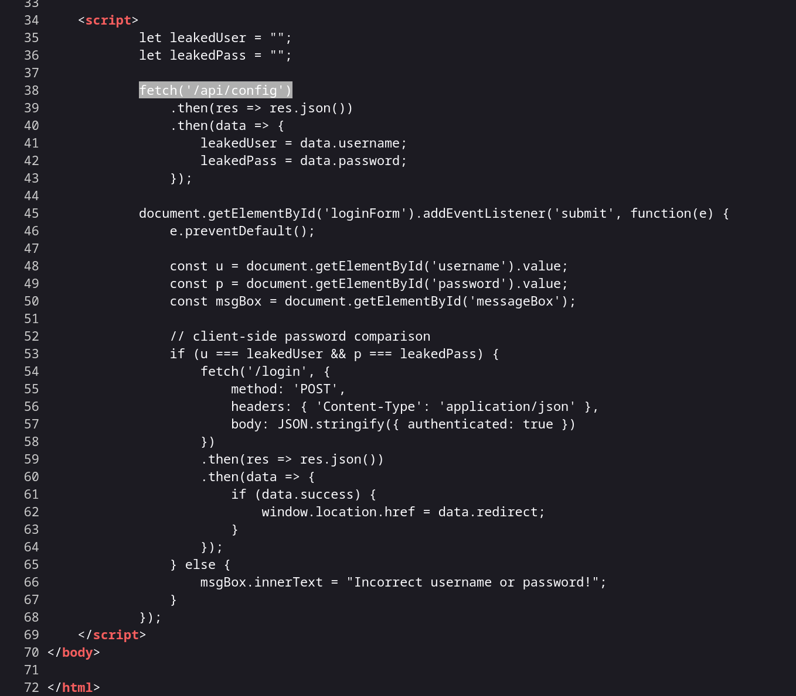
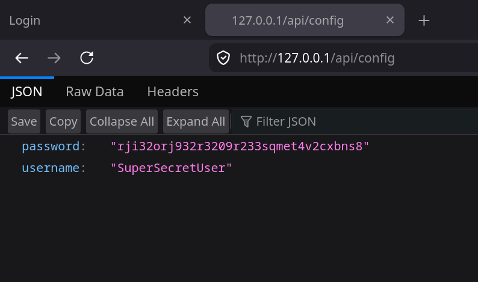
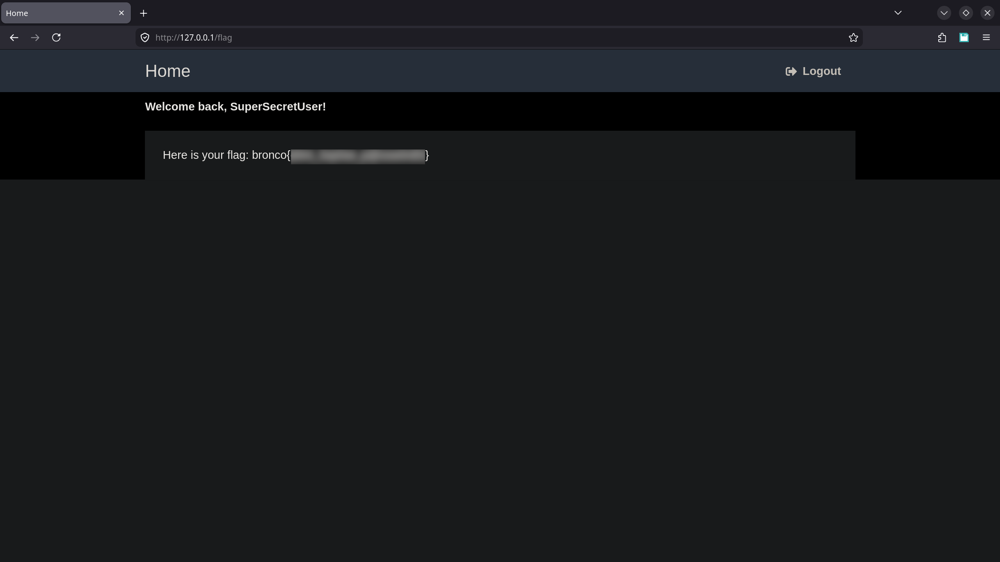
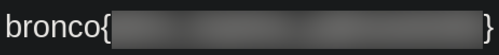

**`e0_ | h1gkpo | BroncoCTF 2026 | Web`**

# Challenge Information
## Target Difficulty: Beginner

## Description

I just finished developing my very first API to handle secure logins to my very own website! To keep things extra secure, I won't even tell you my username, so now there's really no way you can hack me!

http://login.web.broncoctf.xyz

## Author
tiffany_ttn

official git repo [link](https://github.com/SCUBroncoSec/BroncoCTF-2026-Public/tree/main/Challenges/Web/Super%20Secure%20Server)

---

# Steps
1. when you visit the webpage you get a login screen.

2. upon inspection of the source code we discover a javascript code. The script reads data.username and data.password from "/api/config" path  to verify the login.

3. next we try to load the "/api/config" subdirectory 

voila !! we got the credentials. It is stored in cleartext

4. now login with the key

 Flag 

